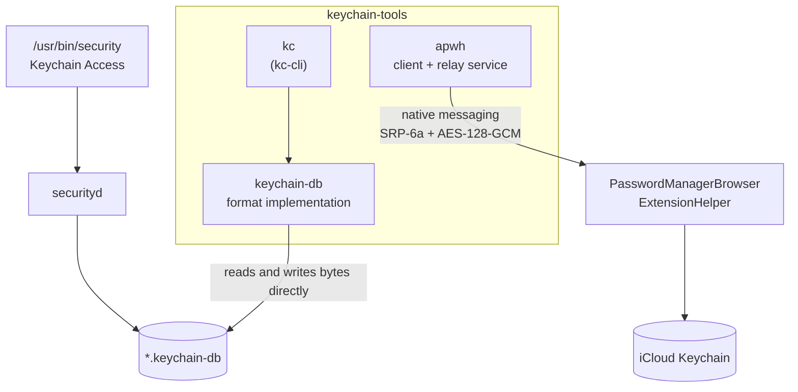

<div align="center">

# keychain-tools

**macOS keychains, from the bytes up.**

A from-scratch implementation of Apple's on-disk keychain format — no `securityd`,
no Security framework, no entitlements — plus a client for Apple Passwords that
speaks the same protocol browser extensions do.

[](https://github.com/bryanmatteson/keychain-tools/actions/workflows/ci.yml)
[](https://crates.io/crates/keychain-db)
[](https://crates.io/crates/kc-cli)
[](https://docs.rs/keychain-db)
[](#verification)
[](#requirements)
[](#requirements)
[](LICENSE)

</div>

---

Every other way to read a macOS keychain goes through `securityd`. You link the
Security framework, you inherit its entitlement requirements, its prompts, its
process model, and its opinion about who you are. It works — right up until you
want to read a keychain file from a build script, a container, a recovery
context, or any process that isn't a signed app in a logged-in GUI session.

This repository takes the other road: it implements the file format.

`kc` opens a `.keychain-db`, derives the master key from the password, unwraps
the item keys, and decrypts secrets itself. No daemon is involved, so there is
no daemon to satisfy. The catch — and it is a real one — is that bypassing
`securityd` also bypasses the ACL enforcement `securityd` provides. See
[Security posture](#security-posture) before you reach for it.

## Proof it actually interoperates

The interesting claim is not "it parses keychains." It is that files cross the
boundary in both directions, unmodified, with Apple's own tooling on the other
side. Here is that round trip, verbatim:

```console
$ security create-keychain -p hunter2 ./apple.keychain-db
$ security add-generic-password -a ci -s github.com -l deploy-token \
      -w 'ghp_realsecret123' ./apple.keychain-db

# Apple wrote it. Now read it without going anywhere near securityd:

$ kc get class:generic account:ci -o label,account,service \
      -P hunter2 --keychain ./apple.keychain-db
deploy-token  ci  github.com

$ kc get class:generic account:ci -o secret -P hunter2 --keychain ./apple.keychain-db
ghp_realsecret123
```

And back the other way — `kc` writes, `security` reads, secret included:

```console
$ kc create --no-access-policy -P hunter2 ./demo.keychain-db
created ./demo.keychain-db
$ kc add class=generic label=deploy-token account=ci service=github.com \
      kind="api key" -w 'ghp_realsecret123' -P hunter2 --keychain ./demo.keychain-db
stored

$ security unlock-keychain -p hunter2 ./demo.keychain-db
$ security find-generic-password -a ci -s github.com ./demo.keychain-db
keychain: "./demo.keychain-db"
version: 256
class: "genp"
attributes:
    0x00000007 <blob>="deploy-token"
    "acct"<blob>="ci"
    "cdat"<timedate>=0x32303236303733313039313533375A00  "20260731091537Z\000"
    "desc"<blob>="api key"
    "svce"<blob>="github.com"
    ...

$ security find-generic-password -a ci -s github.com -w ./demo.keychain-db
ghp_realsecret123
```

`--no-access-policy` is what makes that last line work, and leaving it off is the
safer default. Without it, `kc create` saves a prompt policy and writes item ACLs
that pre-authorize nobody — `securityd` then refuses the read until a human
approves it, which is exactly what you want for a keychain that isn't built for
unattended interop. `kc trust -a ci -A` relaxes an existing item the same way.

The strictest version of this claim is a test, not a demo:
[`reserializing_a_macos_keychain_is_byte_identical`](keychain/tests/keychain_container.rs).
Open a keychain macOS wrote, serialize it back out, and the bytes match — free-list
links, record slots, index regions, unknown fields and all.

## What's in the box

| | | |
| --- | --- | --- |
| [**`keychain-db`**](keychain/README.md) | Rust library for the `.keychain` / `.keychain-db` format. Open, query, decrypt, edit, re-key, re-seal. | [crates.io](https://crates.io/crates/keychain-db) · [docs.rs](https://docs.rs/keychain-db) |
| [**`kc-cli`**](kc-cli/README.md) | The `kc` command, built on `keychain-db`. A typed query language, projections, and reference pipelines. | [crates.io](https://crates.io/crates/kc-cli) |
| [**`apwh`**](apwh/README.md) | Apple Passwords / iCloud Keychain over the native-messaging helper. SRP-6a handshake, AES-GCM payloads, background relay service. | GitHub only |

`apwh` shares no code with the other two — it talks to a live Apple helper
process rather than a file on disk. It lives here because it solves the adjacent
half of the same problem.



## Install

```bash
cargo add keychain-db      # library
cargo install kc-cli       # the `kc` binary
```

`apwh` is not published to crates.io — read [why](#apwh-and-the-macos-26-wall) first:

```bash
cargo install --git https://github.com/bryanmatteson/keychain-tools --bin apwh
```

### Requirements

Rust **1.87+** (edition 2024). macOS for runtime use; the crates build as
libraries elsewhere, but the CLIs and integration tests expect macOS.

## `kc` — a query language for your keychain

Most keychain CLIs give you `find-generic-password` and a shrug. `kc get` is a
real query surface: typed predicates, comparisons, SQL-LIKE wildcards, Unicode
case and diacritic folding, ordered projections, and deduplication.

```bash
# Typed predicates, ANDed. `%` is any run, `_` is one character.
kc get class:internet 'label[cd]:com.%' 'icmt:%2026%'

# Comparisons work on the field's actual type, including dates.
kc get 'cdat:<20260515074219Z' 'mdat:>=20250515074219Z'

# Project the fields you want, deduplicate the tuples.
kc get 'service:_%' -o account,service --distinct

# Pipe straight into other tools.
kc --json get class:internet -o account,server,port
kc get class:generic account:deploy -o secret | docker login --password-stdin
```

The feature worth pointing at first is `@ref`: opaque, **revision-bound** item
references that make read-then-write pipelines safe.

```bash
kc get class:internet 'account[c]:bryan%' -o @ref | kc set comment="rotated 2026-07" --for -
```

Each reference pins the keychain, its database revision, the record class, and
the record number. `set` validates the entire stream before touching memory and
saves once. A stale, duplicate, missing, or wrong-keychain reference aborts the
whole operation without writing a byte — so a keychain that changed underneath
you fails loudly instead of silently updating the wrong item.

`set` rotates secrets too, re-sealing them under the item's existing key:

```bash
kc set -w 'new-token' --for 'class:generic account:ci service:github.com'
kc set -w --for 'class:generic account:ci'    # read it from stdin or a prompt
```

Attributes are stored in the clear, so changing one needs no password at all.
Key material is different: a secret change requires the keychain password, obeys
the keychain's access policy, and refuses a query matching more than one item
unless you pass `--all`.

Inspection works on a **locked** keychain, because the container is not the
secret:

```console
$ kc info ./apple.keychain-db          # no password needed
keychain         ./apple.keychain-db
format version   0x00010000
blob version     0x00000100
sequence         0
idle timeout     300s
lock on sleep    true
key derivation   PBKDF2-HMAC-SHA1, 1000 iterations, 3DES
salt             04455ca4a2570dd6cc7ad2c697ac1774e0ec8128
iv               972c88e7ebdc3b25

tables:
  0x00000000    11 records  CSSM_DL_DB_SCHEMA_INFO
  0x00000001    80 records  CSSM_DL_DB_SCHEMA_INDEXES
  0x00000002   155 records  CSSM_DL_DB_SCHEMA_ATTRIBUTES
  0x00000003     0 records  CSSM_DL_DB_SCHEMA_PARSING_MODULE
  0x0000000f     0 records  CSSM_DL_DB_RECORD_PUBLIC_KEY
  0x00000010     0 records  CSSM_DL_DB_RECORD_PRIVATE_KEY
  0x00000011     1 records  CSSM_DL_DB_RECORD_SYMMETRIC_KEY
  0x80000000     1 records  CSSM_DL_DB_RECORD_GENERIC_PASSWORD
  0x80000001     0 records  CSSM_DL_DB_RECORD_INTERNET_PASSWORD
  0x80000002     0 records  CSSM_DL_DB_RECORD_APPLESHARE_PASSWORD
  0x80008000     1 records  CSSM_DL_DB_RECORD_METADATA

$ kc verify -P hunter2 ./apple.keychain-db
database signature   ok
key signatures       1/1 verified
items readable       1/1
index regions        11/11 understood
```

Exit codes are stable and scriptable: `0` success, `44` no match, `45` wrong
password, `46` duplicate, `2` operational error.

Full command reference: [`kc-cli/README.md`](kc-cli/README.md).

## `keychain-db` — the library

```rust
use keychain::{Expression, KeychainFile};

let mut file = KeychainFile::open("demo.keychain")?;
file.unlock(b"password")?;

let query = Expression::parse("class:generic account:alice service:github.com")?;
let item = file.select(&query)?.remove(0);
assert_eq!(file.secret(&item)?.as_slice(), b"gh-token-abc");
```

Beyond reading, it edits in place: update and delete items, rewrite access
control, change the keychain password, and adjust lock settings — then
re-serialize a file macOS still accepts. Identity import/export covers combined
PEM, PKCS#8, PKCS#1, and PKCS#12 in DER or PEM form.

API tour: [`keychain/README.md`](keychain/README.md) · [docs.rs](https://docs.rs/keychain-db)

## The parts that were actually hard

The container layout is [publicly documented](https://github.com/libyal/dtformats/blob/main/documentation/MacOS%20keychain%20database%20file%20format.asciidoc).
Almost everything that makes a keychain *work* is not. A sampling of what
byte-level comparison against macOS turned up:

- **A record's number is the slot it occupies.** Slot arrays double as free
  lists: even values are record offsets, odd values are links to the next free
  slot, `0` terminates the chain. The chain runs *downward* from the highest
  free slot. Deleting shortens the array only when the freed slot is the last
  one — and never cascades past other trailing free slots. Reproduce this wrong
  and a keychain macOS has deleted from stops round-tripping.

- **Apple's key wrapping reverses its own bytes mid-algorithm.** Two 3DES-CBC
  passes with a byte reversal between them:
  ```text
  inner = 3DES-CBC(db key, iv, descriptive_data_length(0) || item key)
  blob  = 3DES-CBC(db key, MAGIC_CMS_IV, reverse(iv || inner))
  ```

- **The signature algorithm depends on the blob version.** `0x100` uses Apple's
  legacy BSafe-compatible HMAC; `0x101` and `0x200` use standard HMAC-SHA1.
  Sign a blob with the wrong one and `securityd` rejects a file that looks
  perfectly well-formed.

- **Attribute order follows the schema table, not the attribute ID.** A keychain
  is a CSSM database carrying its own schema; four schema tables describe every
  other relation. `kc` reads that schema out of the file rather than hard-coding
  layouts, which is why keychains from different macOS versions parse.

- **Unique-index attributes must be present even when empty.** An
  internet-password item with no port stores `port = 0` and an empty path —
  otherwise it drops out of its relation's unique index.

- **In ACLs, the 20-byte value beside each trusted application is a legacy CDSA
  code hash, not a modern `cdhash`.** Testing showed macOS accepts zeros on the
  allowed-access path, so `kc` writes zeros rather than synthesizing a value it
  cannot compute correctly.

Where the meaning of a field is still unknown, it is *named* as unknown —
`AclEntry::subject_words` — and preserved verbatim rather than guessed at.

The full write-up, including the key-derivation chain and the index format, is
in [`keychain/README.md`](keychain/README.md#file-format).

## `apwh` and the macOS 26 wall

macOS 14+ ships `PasswordManagerBrowserExtensionHelper`, the native-messaging
host that browser extensions use to reach iCloud Keychain. `apwh` reads the
same manifest Chrome and Firefox read, launches the helper directly, runs the
SRP-6a handshake (the six-digit PIN macOS shows on screen), and encrypts every
payload end-to-end. A background service owns the helper process; clients hold
the key. The service relays ciphertext and can decrypt nothing.

> [!IMPORTANT]
> **On macOS 26 this cannot work, and no amount of code fixes it.** Apple added a
> *parent launch constraint* to the helper: only an allowlisted, signed browser
> may be its parent process. A CLI that spawns it gets `SIGKILL`ed at `exec` —
> in milliseconds, with no output and no log entry.

Decoding the constraint blob (`LWCR`, code-directory slot 9) gives an `$or` over
a fixed allowlist. The parent must either hold
`com.apple.developer.web-browser.public-key-credential` — an entitlement Apple
grants to browser vendors — or match a signing-identifier and team-identifier
pair from a list of a few dozen shipping browsers. There is no entry for a
user-built binary, and self-signing the entitlement does not work.

No CLI can be the helper's parent. Not with `sudo`, not from a LaunchAgent
(the parent would be `launchd`), not with the sandbox disabled. `apwh doctor`
tells you where your machine stands:

```console
$ apwh doctor
parent launch constraint   yes — only allowlisted browsers may launch it
helper launches            no
problem                    macOS killed the Passwords helper immediately (SIGKILL at launch).
```

The protocol work remains correct and fully tested; only the hop that *spawns*
the helper is blocked. A browser-hosted bridge would restore it — the browser is
an allowlisted parent, and every line of protocol code keeps working. That path
is not implemented here. The options, and the full constraint analysis, are in
[`apwh/README.md`](apwh/README.md#macos-26-and-parent-launch-constraints).

## Verification

**310 tests** across the workspace, run on macOS in CI on every push.

The keychain crates are tested against reality rather than against themselves:
byte-identical reserialization of macOS-written files, signature selection by
blob version, schema-driven attribute order, index reconstruction, duplicate
detection through unique indexes, and interop in both directions with
`/usr/bin/security`. Fixtures that need a real system keychain are generated
during the run instead of committed as opaque binaries; tests requiring
`security` skip when it is unavailable.

`apwh`'s SRP and AES-GCM are pinned to vectors generated by running the
reference implementation's own TypeScript under Node — a padding or byte-order
mistake fails them. Its end-to-end tests run real CLI processes against a real
service over a real socket, with a fake helper standing in for the one macOS
will not let anyone launch.

```bash
cargo test --workspace --all-targets
mise run verify   # fmt + clippy + tests + doc tests + docs + release build + package
```

The `verify` gate is exactly what CI runs. Expanded form:

```bash
cargo fmt --all -- --check
cargo clippy --workspace --all-targets --all-features --locked -- -D warnings
cargo test --workspace --all-targets --all-features --locked
cargo test --workspace --doc --all-features --locked
RUSTDOCFLAGS="-D warnings" cargo doc --workspace --all-features --no-deps --locked
cargo build --workspace --release --all-features --locked
```

## Security posture

Read this part.

**The legacy keychain format is weak by modern standards.** PBKDF2-HMAC-SHA1 at
1,000 iterations protects 3DES key material. Anyone holding a keychain file can
run offline password guesses at high speed. 3DES and SHA-1 are properties of the
format, kept for interoperability — not choices made here.

**Direct file access bypasses `securityd`, and therefore bypasses ACL
enforcement.** Item ACLs govern access *through* `securityd`. They do not
restrict `kc`, because `kc` decrypts the database itself. Anyone with the file
and its password can read every secret in it. That is the trade this tool makes.

What is done about it: new keychains default to a `hybrid` access policy whose
decision is `prompt`, so direct secret access requires an explicit
`--interactive` and native ACLs pre-authorize no caller. Files are created
`0600` and existing modes are preserved. Secret buffers are zeroized on drop
where the implementation allows. ACL forms that are not modeled are preserved
rather than rewritten. Password input prefers prompts, environment variables,
and files over `argv`.

For `apwh`, the session key is equivalent to a passphrase-less SSH private key:
`0600` in a `0700` directory, deliberately not in the login keychain, because
the service must work unattended after login. `apwh logout` forgets it.

Vulnerability reports: [SECURITY.md](SECURITY.md) — please use private
disclosure, not a public issue.

## A note on naming

`keychain-db` supersedes the crates.io package name `keychain-rs` (published
through 0.2.6). The Rust library target is still `keychain`, so `use
keychain::...` imports are unchanged.

## License

MIT. The format documentation draws on the GFDL-licensed dtformats
specification and Apple's APSL-licensed source; no code from either is included.
